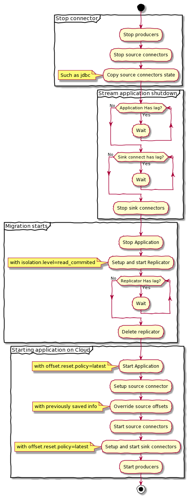

# Kafka Streams migration example using Replicator

## Key points

- If Kafka Streams leverage `exactly-once`, Replicator must be configured with `isolation.level=read_committed`
- Migrated application need to be restarted with `auto.offset.reset=latest`
- In order to migrate connectors one by one, for source connectors, data must be extracted from the topics `connect-configs` and `connect-offsets`.
  - Source connectors (e.g. JDBC Source or Filestream source) commit offsets in Kafka Connect internal topics `connect-offsets`.

## Migration process

* On the source cluster:
  * Stop producers and source connectors
  * Stop the Kafka Streams application
  * Wait for each topology and connectors to clear up lag.
  * Copy Kafka Connect source connector offset json payloads
  - Stop consumer and sink connectors
* Migration start:
  * Start Replicator with `isolation.level=read_committed`
  * Wait for replicator to catch up
* Start application on the destination cluster
  * Setup connectors and source connect offset json playloads
  * Start producers and connectors

[](http://www.plantuml.com/plantuml/uml/dLF1Rjim3BtxAuYUcai_84Mn3jrXbst0SXXs6ZIBYRdAea1I2O9X_pxLib75mGwhOHW67_dq7aazgZcnF8PEdoac9sw4mKL_4ZB322OP6qW7v_b4yL21Rghk2cPan15kTiO9UeuHUsEvWTyTb6SxXPEmppsAtZT1vImzlfOiu1EdypK8QiwmfaGstC8kzmCuXL_-Pz_zwIwr21RDBgL0lPjYEcGh1k8Yx3HGGBXztwHyB6J17TvjW1HklwDkIkOawPiZgqTZz7FbPzwqH3kApujS6Dx2jBIb4BLDMLdxH0UfSgS9QFLJInipzrCGBITmqTTS-8eLPodmtCKJsG2a7AQoku1730-2pl_eUHp9qBSkNndUrAtj1mne2D88MK_kvJyUBcPNtgV0sJTBLRBMTYySyNwlQ7U2Bz_49U_yK2oYsio0bgzNSDx0BqSK8OyBNidqwf0aU2JE6iwWxeWUAEwvKVZF5LyFPZtp_tOpiJIth3IrK-FKFMBqUGn_0G00)

## Application architecture

- A source connector stream `data/source.txt` and push it to `streams-plaintext-input`
- The Kafka Streams application count the occurence of each world from the `streams-plaintext-input` topic and push the result to `streams-wordcount-output`
- This application has two internal topics: `streams-wordcount-counts-store-repartition` and `streams-wordcount-counts-store-changelog`
- A sink connector consume the `streams-wordcount-output` topics and write the value of each message in `data/sink.txt`


## How to run the example

```sh
export CCLOUD_CLUSTER=XXXXX.confluent.cloud:9092
export CLUSTER_API_KEY=XXXXX
export CLUSTER_API_SECRET=XXXXX

# Start the local environment, the connectors and Kafka Streams
./up

# Migrate Kafka Streams and connectors to Confluent Cloud
./migrate
echo "World" >> data/source.txt
sleep 10
cat data/sink.txt
````

